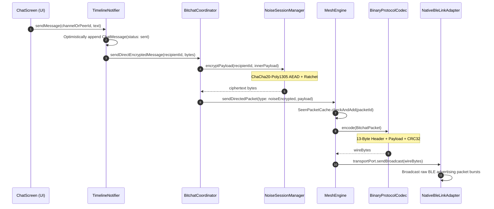
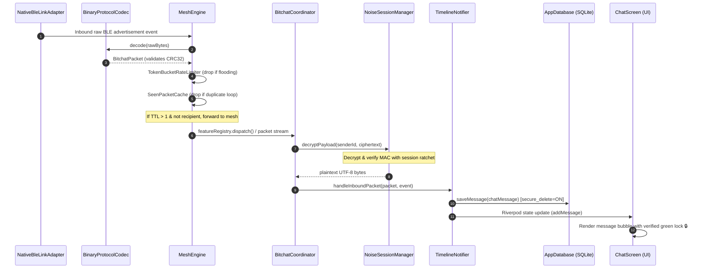

# Grid: Decentralized Peer-to-Peer Mesh & Nostr Messenger

> A censorship-resistant, zero-infrastructure, end-to-end encrypted mobile chat application built with **Flutter**, powered by the **BitChat** mesh protocol and **Nostr** internet fallback.

[](LICENSE)
[](https://github.com/permissionlesstech/bitchat)
[](BITCHAT_FLUTTER_ARCHITECTURE.md)
[](https://riverpod.dev)
[](test/)
[](#-minimal-monochrome-design-system)

---

## ✨ Core Features & Capabilities

### 📡 1. Decentralized BLE Mesh & Store-and-Forward (DTN)
- **Zero Central Infrastructure**: Operates 100% off-grid over ad-hoc Bluetooth Low Energy (BLE) links with native dual-role (Central + Peripheral) radio drivers.
- **Controlled Multi-Hop Flooding**: Propagates packets through intermediate relay nodes using adaptive TTL clamping ($7 \to 5$ based on local peer density) and split-horizon filtering.
- **Loop & Echo Suppression**: 1,000-entry LRU `SeenPacketCache` discards duplicate frames across both mesh radio and Nostr links.
- **Delay-Tolerant Networking (DTN)**: Offline "Courier Mules" buffer encrypted bundles in local storage and deliver them upon physical proximity with recipient nodes.

### 🔐 2. End-to-End Cryptography (`Noise_XX` E2EE)
- **Forward Secrecy & Mutual Authentication**: 1-on-1 private chats and voice notes negotiate session keys via the **Noise Protocol Framework (`Noise_XX_25519_ChaChaPoly_SHA256`)**.
- **Tamper-Proof Encryption**: Sealed with ChaCha20-Poly1305 AEAD, 12-byte wire nonces, and 1024-bit sliding-window replay protection.
- **Cryptographic Safety Numbers**: Symmetric 60-digit fingerprint comparison for out-of-band identity verification and MITM detection.
- **Zero Knowledge in Transit**: Neither intermediate mesh relay nodes nor remote Nostr WebSocket relays can inspect packet contents or metadata.

### 🎙️ 3. Push-to-Talk (PTT) Voice Engine
- **Ultra-Compact Audio Compression**: High-efficiency 16 kHz AAC-LC voice compression tuned specifically for low-bandwidth BLE radio transmission.
- **Tactile Waveform Bubbles**: Interactive 36-bar audio waveform player with multi-speed playback (`1.0x` / `1.5x` / `2.0x`) and live amplitude metering.
- **MTU Packet Slicing**: Large voice notes are automatically sliced into MTU-safe fragments via `FragmentCodec` and seamlessly reassembled on receiving devices.

### 🔍 4. Privacy-Preserving Contact Discovery
- **Cryptographic Phone Commitments**: Completely eliminates cleartext phone number broadcasts. Devices advertise an irreversible 8-byte hash tag:
  $$\text{SHA-256}(\text{"grid-phone-v1:"} \mathbin{\Vert} \text{digits})[0..8]$$
- **Zero-Exposure Contact Search**: Find contacts instantly by typing numbers in `PeerDirectoryScreen`—queries are hashed with the identical domain-separated scheme to match without leaking numbers over the air or to local databases.

### 🛡️ 5. Anti-Vampire DoS Defense & Forensic Scrubbing
- **Vampire Battery Attack Protection**: `TokenBucketRateLimiter` enforces a 10 pkts/sec ceiling (20 token burst capacity) per link to drop malicious high-frequency RF floods and prevent battery exhaustion.
- **Zero-Trace SQLite Database**: Hardened with `PRAGMA secure_delete = ON;` and `PRAGMA wal_checkpoint(TRUNCATE);` to prevent unallocated freelist data recovery.
- **Forensic Audio Shredding**: Audio voice notes are overwritten with cryptographic random bytes (`Random.secure()`) followed by zero-fill before unlinking.
- **Emergency Panic Button**: Instantly zeroes private keys in RAM, flushes session state, and purges databases with a single slider gesture.

### 🌐 6. Dual Transport (Offline BLE Mesh + Nostr Relays)
- **Radio Silence by Default**: Operates in `bleOnly` stealth mode to prevent IP address leakage.
- **Opt-In Global Reach**: Optionally bridge separated meshes and reach remote mutual contacts via Nostr WebSocket relays (NIP-01, NIP-04, NIP-44).
- **Geohashed Ephemeral Channels**: Spatial public rooms (e.g. `#geo-9q8y`) calculated via Morton Z-order curve geohashing for hyper-local disaster coordination.

### 🎨 7. Minimalist Monochrome Interface & Terminal Commands
- **Distraction-Free Design**: Zinc-50 / high-contrast dark palette with responsive Left Navigation Drawer and Live Mesh Radar.
- **Terminal Slash Commands**: Full CLI-style command interface (`/msg`, `/who`, `/ping`, `/join`, `/nick`, `/phone`, `/clear`, `/panic`).
- **Unified Conversation Threads**: Consolidated peer chats, channel messaging, and verified green encryption badges.

### 🧪 8. Interactive Web Mesh Simulator
- **Zero-Dependency Simulation**: Self-contained client-side web sandbox in `public/` with no external dependencies.
- **Live In-Browser Mesh Canvas**: Interactive multi-hop BLE simulation supporting node dragging, signal radius inspection, cellular blackout toggling, and courier sneakernet dispatch.

---

## 🏛 Architecture Overview

Detailed architectural design and protocol reverse-engineering are documented in:
👉 **[BITCHAT_FLUTTER_ARCHITECTURE.md](BITCHAT_FLUTTER_ARCHITECTURE.md)**

### Zero-Overhaul Extensibility & Plugin Architecture
To prevent architectural stalling, Grid employs an **Open-Closed Plugin Pattern**:
- **Pure Infrastructure Mesh Engine:** The core `MeshEngine` handles only low-level networking (flooding, deduplication LRU, TTL clamping, randomized jitter, and link relaying). It has **zero knowledge** of specific message types or features.
- **Protocol Feature Registry:** High-level features (Public Chat, Noise E2EE, Couriers, Files, Voice, Groups, Bulletin Boards) are self-contained `ProtocolFeatureModule` plugins that register dynamically. New features are added without modifying the core mesh engine.
- **Tolerant Wire Codec:** Unknown future packet types (`MessageType.unknown`) are forwarded across the mesh safely without crashing or dropping packets.
- **Pluggable Multi-Transport Pipeline:** Abstract `TransportPort` allows seamlessly adding new transports (e.g. Local LAN Wi-Fi Direct, LoRa radios, WebRTC) alongside BLE Mesh and Nostr.
- **Configurable Ephemerality:** Clean repository port supporting both default volatile in-memory storage (zero disk trace) and optional encrypted local persistence with secure zeroization.

```
┌────────────────────────────────────────────────────────┐
│             FLUTTER PRESENTATION (Minimalist UI)       │
│     Chat Screen, Left Navigation Drawer, Peer Radar    │
└──────────────────────────┬─────────────────────────────┘
                           │
┌──────────────────────────▼─────────────────────────────┐
│                 APPLICATION LAYER (Riverpod)           │
│        TimelineState, PeerState, ChannelState          │
└──────────────────────────┬─────────────────────────────┘
                           │
┌──────────────────────────▼─────────────────────────────┐
│          DOMAIN CORE: MODULAR PLUGIN ENGINE            │
│  ┌──────────────────────────────────────────────────┐  │
│  │ ProtocolFeatureRegistry (Chat, Noise, Couriers)  │  │
│  └────────────────────────▲─────────────────────────┘  │
│                           │ Dispatches Inbound Payload │
│  ┌────────────────────────┴─────────────────────────┐  │
│  │ MeshEngine (Flooding, Dedup, Jitter, TTL Clamp)  │  │
│  └────────────────────────▲─────────────────────────┘  │
│                           │                            │
│  ┌────────────────────────┴─────────────────────────┐  │
│  │ MultiTransportRouter (BLE Mesh -> LAN -> Nostr)  │  │
│  └──────────────────────────────────────────────────┘  │
└──────────────────────────┬─────────────────────────────┘
                           │
┌──────────────────────────▼─────────────────────────────┐
│                 PORTS & ADAPTERS LAYER                 │
│  TransportPort   CryptoPort   StoragePort   PowerPort  │
└────────────┬───────────────────────┬───────────────────┘
             │                       │
     ┌───────┴───────┐       ┌───────┴───────┐
     ▼               ▼       ▼               ▼
[Native BLE]  [Simulated] [Dart Crypto] [Nostr WS]
```

### 🔄 End-to-End Message Transmission Lifecycle

The message lifecycle is split into two clean stages: **Outbound Transmission** (Sender) and **Inbound Processing** (Receiver).

#### 1. 📤 Outbound Pipeline (Sender Node A → BLE Airwaves)



#### 2. 📥 Inbound Pipeline (BLE Airwaves → Receiver Node B UI)



---

## 🛠 Engineering Methodology: Build-and-Test Incrementalism

We adhere strictly to an **incremental, verifiable engineering pattern**:
1. **Piece-by-Piece Construction:** We build one self-contained, high-cohesion module at a time.
2. **Immediate Verification:** Every module is accompanied by comprehensive automated tests (unit, property, or simulation).
3. **Commit & Push:** Once verified, changes are committed and pushed incrementally to the upstream repository.

> 📖 **Historical Delivery Log**: For the complete chronological sprint history, test metrics, and architectural milestones across all 14 phases, see [docs/DELIVERY_PHASES.md](docs/DELIVERY_PHASES.md).

---

## 📦 Repository & Local Environment

- **Git Remote:** `https://github.com/sushantdev-git/grid.git` (formerly `dec-chat.git`)
- **Default Branch:** `main`
- **Author:** Sushant Mishra (`sushantkumar6700@gmail.com`)

### Environment & Toolchain
- **Flutter SDK:** `3.47.4 • channel stable`
- **Dart SDK:** `3.13.3 • macos_arm64`
- **Run Tests:**
  ```bash
  flutter test
  ```
- **Analyze Code:**
  ```bash
  flutter analyze
  ```

---

## 📄 License & Attribution

This project is licensed under the **GNU General Public License v3.0** — see the [LICENSE](LICENSE) file for details.

### Acknowledgements & Attribution
- **BitChat Protocol:** Grid's mesh networking foundation and protocol specifications are based on the work by [Permissionless Tech](https://github.com/permissionlesstech/bitchat).
- **Noise Protocol Framework:** Cryptographic handshakes and forward-secret sessions follow the [Noise Protocol Framework](https://noiseprotocol.org/) (`Noise_XX`).
- **Nostr:** Decentralized internet relay bridging is powered by the [Nostr Protocol](https://github.com/nostr-protocol/nips) (NIP-01, NIP-04, NIP-44).
